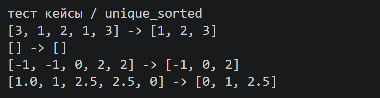
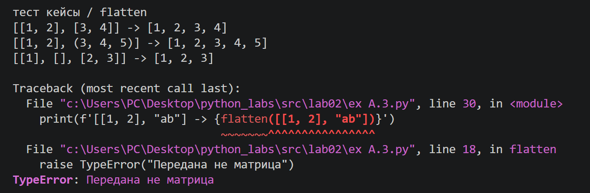
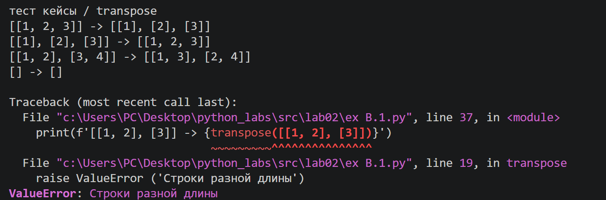
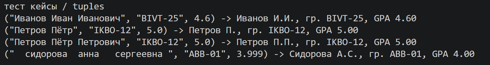

# Отчет по лабораторной работе №2

## Задание A

*Рис. 1. Результат выполнения arrays.py min_max (нахождение максимума и минимума списка)*

*Рис. 2. Результат выполнения arrays.py unique_sorted (сортировка уникальных элементов списка)*

*Рис. 3. Результат выполнения arrays.py flatten (перевод матрицы в вектор)*

## Задание B

*Рис. 4. Результат выполнения matrix.py transpose (транспонирование матрицы)*

*Рис. 5. Результат выполнения matrix.py row_sums (суммы строк)*

*Рис. 6. Результат выполнения matrix.py col_sums (суммы столбцов)*

## Задание C

*Рис. 7. Результат выполнения tuples.py (форматирование записей)*