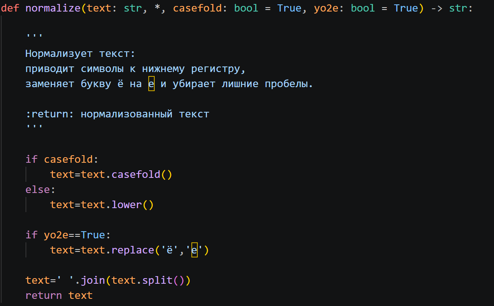
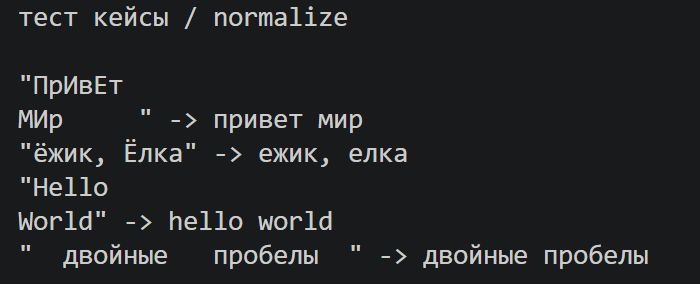
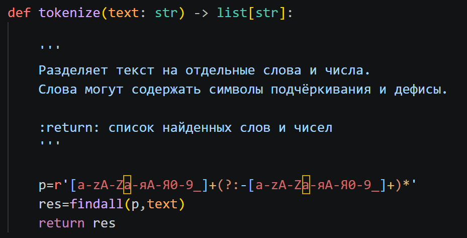
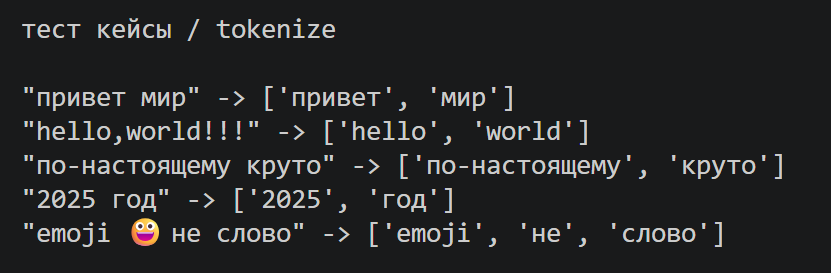
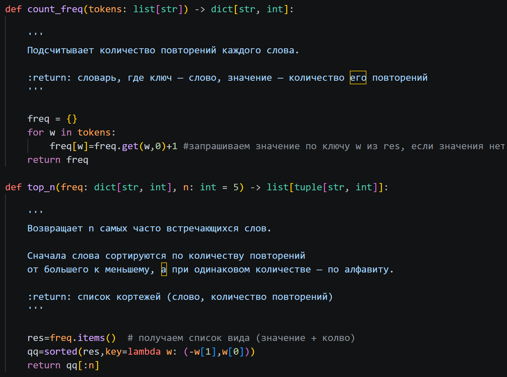
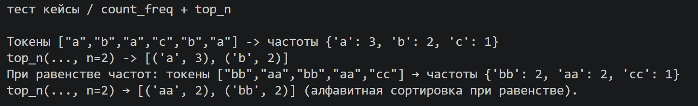
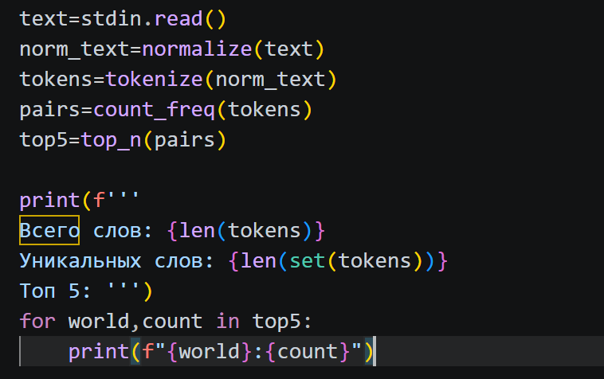
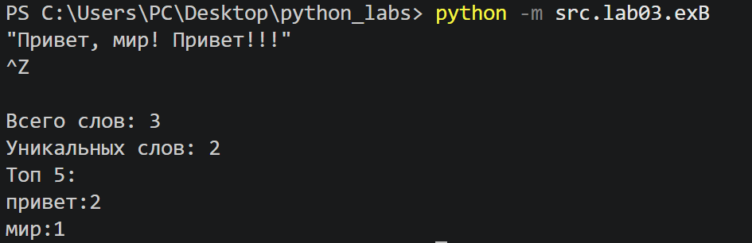

# Отчет по лабораторной работе №3

## Задание A
### A1. Функция `normalize`
Преобразует строку: приведение к нижнему регистру (casefold), замена ё/Ё на е/Е и удаление управляющих символов и лишних пробелов.






### A2. Функция `tokenize`
Разбивает текст на слова (буквы, цифры, знак подчеркивания) по разделителям, сохраняя дефисы внутри слов.





### A3. Функция `count_freq` и `top_n`
`count_freq` подсчитывает, сколько раз встречается каждое слово в тексте. `top_n` выводит N самых часто встречающихся слов, а если частота одинаковая - сортирует их по алфавиту.





## Задание B
Скрипт читает текст из stdin (до EOF), нормализует и токенизирует его с помощью выше приведенных функций, считает общее количество слов, количество уникальных слов и выводит топ-5 самых частых слов.





## Как запустить
### Вручную, с клавиатуры
В терминале из корня репозитория ввести
```
python -m src.lab03.exB
```
Напечатать текст с клавиатуры или вставить его. Далее нажать Enter, чтобы перейти на новую строку (возможно чтение нескольских строк сразу). Чтобы завершить ввод и запустить обработку:

Windows / PowerShell: Ctrl+Z, затем Enter

Linux / macOS: Ctrl+D.